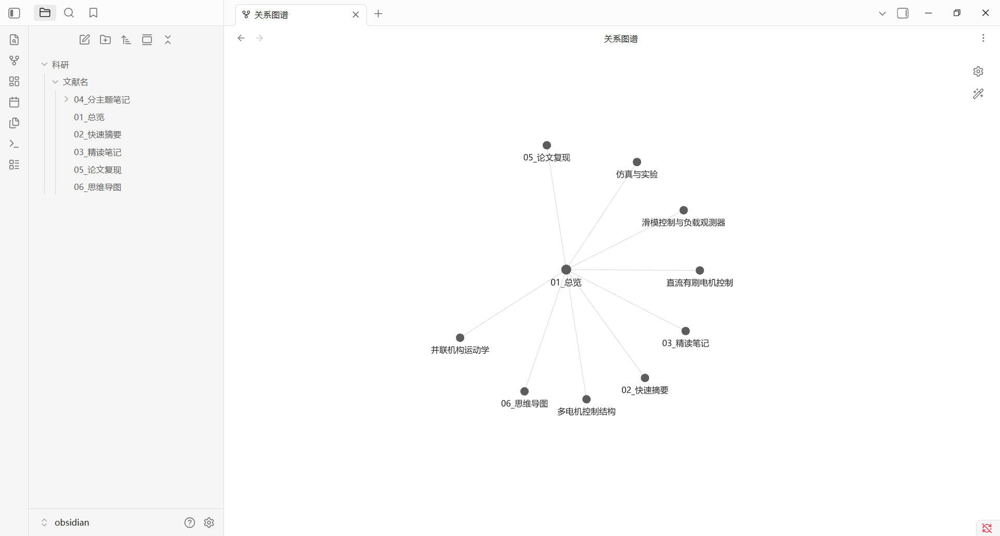

# lit-notes

> Zotero → Obsidian 结构化文献笔记，一键生成 6 文件笔记包。

## 效果预览



*一篇硕士论文的产出：总览 + 快速摘要 + 精读笔记 + 分主题笔记 + 复现指南 + 思维导图*

<!-- 
  截图方法：在 Obsidian 中打开 01_总览.md，截取左侧文件树 + 右侧笔记预览，
  保存为 screenshot.png 放到仓库根目录，然后删除这行注释。
-->

## 这是什么

一个 Cowork skill，用于将 Zotero 中的学术论文精读后，自动在 Obsidian 中生成一套结构化的文献笔记。每篇论文生成 6 个文件：总览、快速摘要、精读笔记、分主题笔记、复现指南、思维导图。

## 产出结构

```
{论文标题}/
├── 01_总览.md              ← 导航枢纽 + 核心贡献
├── 02_快速摘要.md          ← 300 字极简回顾
├── 03_精读笔记.md          ← 七段式深度解读
├── 04_分主题笔记/          ← 按主题独立拆分（2-5 篇）
├── 05_论文复现.md          ← 仿真 + 实验可操作指南
└── 06_思维导图.md          ← Xmind 可直接导入
```

## 安装

将 `SKILL.md` 复制到 Cowork 的 skills 目录下 `lit-notes/` 文件夹中，或通过 Cowork 的 `save_skill` 安装。

## 使用

在 Cowork 中对我说：

- "精读这篇文献，整理成笔记"
- "把 zotero 文件夹下的论文做成 obsidian 笔记"
- "整理文献笔记"

我会自动读取 Zotero 中的 PDF、提取全文、分析结构，然后生成完整的笔记包。

## 适用论文类型

- 硕士/博士论文
- 期刊/会议论文
- 综述文章（自动适配，复现指南改为理论梳理）

## 迭代

这是一个活的 skill——每读一篇新论文，遇到新的需求或问题，都可以更新 SKILL.md 沉淀经验，下次就更准。
